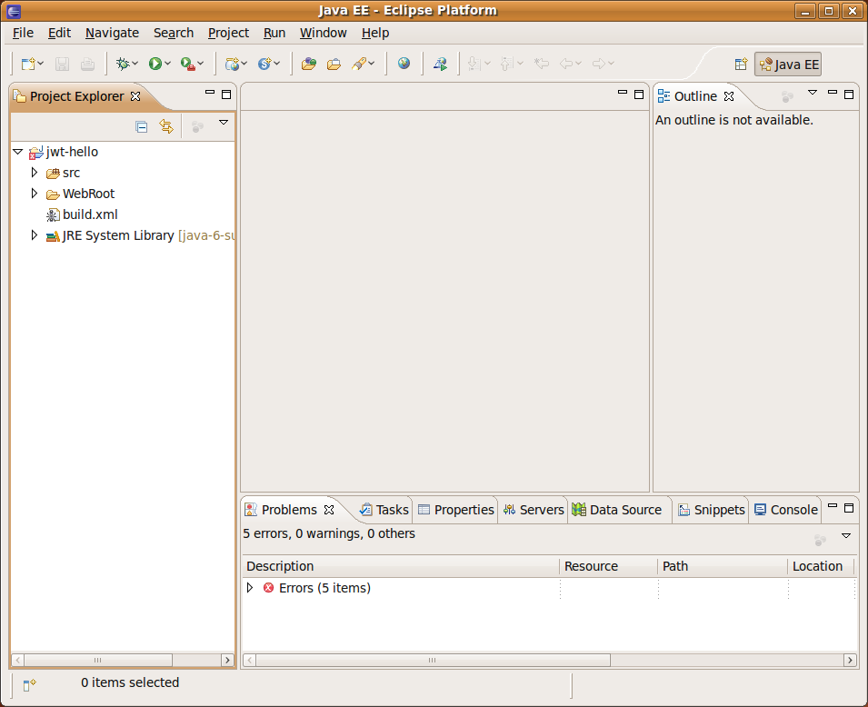
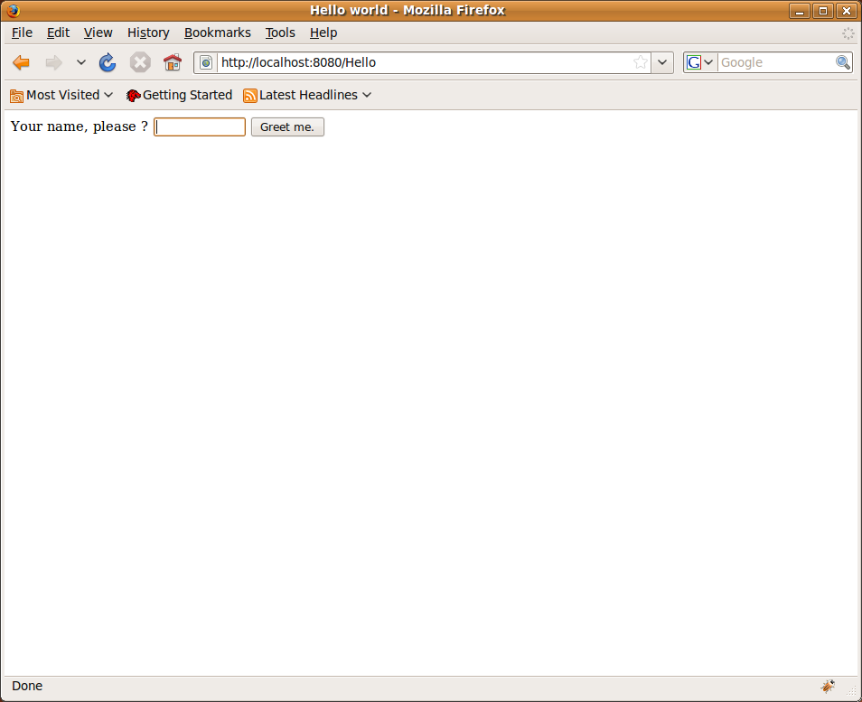
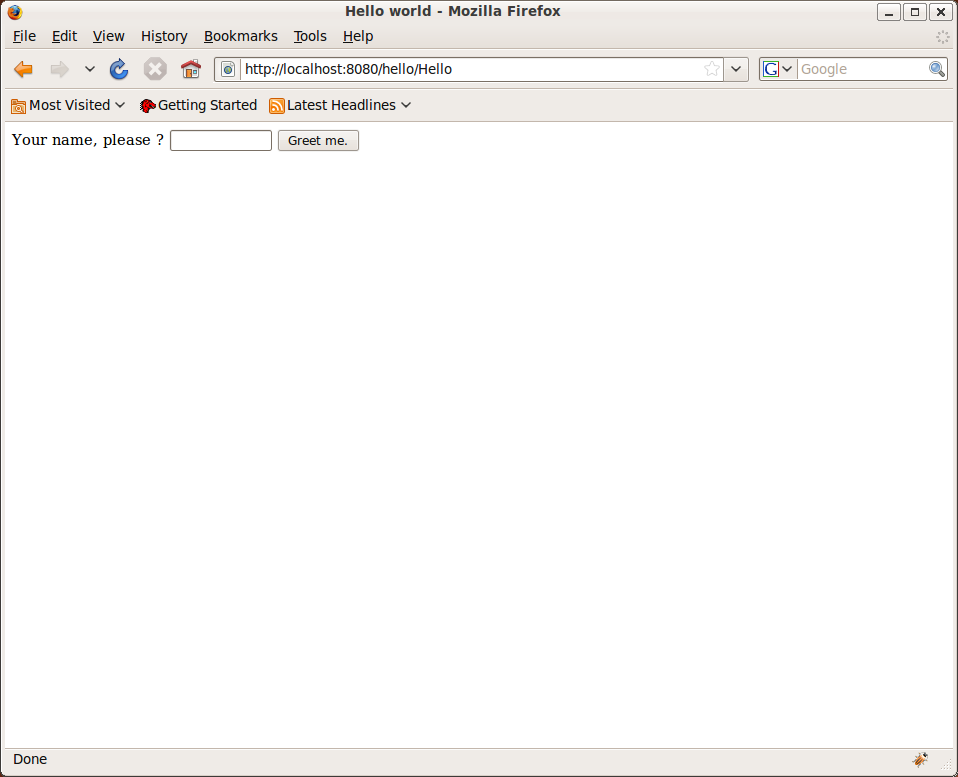

= JWt User Guide

:jwt-github: link:https://github.com/emweb/jwt/blob/master/
:jwt-javadoc: link:https://www.webtoolkit.eu/jwt/latest/doc/javadoc/eu/webtoolkit/jwt/

== Introduction

JWt is a Java library for developing web applications. The library
uses the standard Java Servlet infrastructure, and therefore, a JWt
web application may be deployed in existing
link:https://en.wikipedia.org/wiki/Web_container[servlet containers] or
JEE web application servers.

The API is widget-centric, and inspired by existing Graphical User
Interface (GUI) APIs: a widget is a self-contained class which
encapsulates all event handling related to a user interface
element. The library offers an abstraction of many web-specific
implementation details, including event handling and graphics
support. In this way, the library chooses a rendering strategy based on
the browser's capabilities (AJAX or plain HTML). Still, the library
supports the web semantics of URLs, bookmarks, and forward/backward
navigation and therefore also search engine interoperability.

== Library overview

=== Widgets

The {jwt-javadoc}WWidget.html[`+WWidget+`] class represents a widget,
which provides an abstraction of a visual entity. The entire
user interface is specified by creating a hierarchical structure of
widgets, rooted at
{jwt-javadoc}WApplication.html#getRoot()[`+WApplication.getRoot()+`]. By
reacting to events related to these widgets, you can perform business
logic, and manipulate the widget hierarchy to update the user
interface.

Any descendent class of {jwt-javadoc}WWidget.html[`+WWidget+`] is a
self-contained (reusable) class that encapsulates both the look and
behavior, enabling the design of the user interface in an orthogonal
way.

==== Layout

Widgets are layed out (with a few exceptions) following their
hierarchical structure. You have two main options for the layout of
children within a container. Either you use a CSS based layout, in
which case the CSS style properties of the container and children
together determine the result: each child manages its layout with
respect to its sibling following a (rather complex) set of
rules. Alternatively, JWt provides layout managers that may be used
for layout.

CSS layout considers two important categories of layout. Text-like
widgets ({jwt-javadoc}WWidget.html#setInline(boolean)[inline]) flow
with sibling inline widgets in lines, wrapping at the right edge of
the parent container. In contrast, widgets displayed as a
{jwt-javadoc}WWidget.html#setInline(boolean)[block] stack vertically
with respect to sibling widgets. Block widgets allow more control over
their position and size than inline widgets, and may also float to the
left or right border of the parent container.

Layout managers are implemented by classes that derive from
{jwt-javadoc}WLayout.html[`+WLayout+`] and are used in conjunction with
the {jwt-javadoc}WContainerWidget.html[`+WContainerWidget+`] class.

==== Style

For visual markup of widgets, the recommended way is to use CSS style
sheets. These allow the visual look to be defined separately from the
the rest of the application. External stylesheets may be loaded using
{jwt-javadoc}WApplication.html#useStyleSheet(eu.webtoolkit.jwt.WLink)[`+WApplication.useStyleSheet()+`]
and the external stylesheet may be manipulated using
{jwt-javadoc}WApplication.html#getStyleSheet()[`+WApplication.getStyleSheet()+`].

In the stylesheets, you describe rules that are prefixed by CSS
selectors. By setting matching style classes for your widgets using
{jwt-javadoc}WWidget.html#setStyleClass(java.lang.String)[`+WWidget.setStyleClass()+`],
these rules will be applied to your widgets. The recommended way for
the visual response to events is by changing the style class for the
widget.

In addition to style sheets, Wt also supports the direct manipulation
of a widget's style, using
{jwt-javadoc}WWidget.html#getDecorationStyle()[`+WWidget.getDecorationStyle()+`].

==== Widget containers

With a few exceptions, all widgets are a child of (and contained in) a
container widget such as
{jwt-javadoc}WContainerWidget.html[`+WContainerWidget+`] or
{jwt-javadoc}WTableCell.html[`+WTableCell+`]. A widget is inserted into a
`+WContainerWidget+` by adding the widget to the container using
{jwt-javadoc}WContainerWidget.html#addWidget(eu.webtoolkit.jwt.WWidget)[`+WContainerWidget.addWidget()+`],
or by passing the parent container as an argument to its
constructor. You may also add a widget to a container using a
{jwt-javadoc}WLayout.html[layout manager].

=== Application URL(s)

A JWt application, like any other servlet, is deployed at a specific
location (URL) within your servlet container.
This location is configured through the `+url-pattern+` defined
in the `+servlet-mapping+` within your `+web.xml+` deployment descriptor,
and the context at which the application is deployed. In this mode, a
JWt application is a single page web application: the URL does not
change.

A JWt application may also manage internal paths, which are URLs
_inside_ your application URL. To allow the servlet to handle all
internal paths too, you need to set an `+url-pattern+` that ends with
`+"/*"+`. Then, the internal path may be set and read using
{jwt-javadoc}WApplication.html#setInternalPath(java.lang.String)[`+WApplication.setInternalPath()+`]
and
{jwt-javadoc}WApplication.html#getInternalPath()[`+WApplication.getInternalPath()+`]. When
the internal path changes, this is reflected in the browser URL and an
entry is added to the browser history, allowing the user to use the
back and forward buttons to navigate through your application.

When AJAX is available, the library will always avoid rerendering the
entire widget tree. For a plain HTML session, the session ID is appended
to the URL to avoid the session from reloading when the user navigates
using a {jwt-javadoc}WAnchor.html[`+WAnchor+`] to a new internal URL.

To effectively change the internal path and obtain consistent
behavior with or without JavaScript, you should use a
{jwt-javadoc}WAnchor.html[`+WAnchor+`] to
let the user navigate to a new internal path.
The easiest way to do
this is by supplying a
{jwt-javadoc}WLink.html[`+WLink+`] with
{jwt-javadoc}LinkType.html#InternalPath[`+LinkType.InternalPath+`].
This refers the anchor to a URL generated by
{jwt-javadoc}WApplication.html#getBookmarkUrl()[`+WApplication.getBookmarkUrl()+`]
for the new internal path (handling the plain HTML case), and binds a
JavaScript listener to its
{jwt-javadoc}WInteractWidget.html#clicked()[`+clicked()+`] signal, which changes
the internal path (handling the AJAX case).

Finally, you can listen for path changes using the
{jwt-javadoc}WApplication.html#internalPathChanged()[`+WApplication.internalPathChanged()+`]
event to react to the user navigating through his history.

When your applications uses internal URLs, this has consequences for
relative URLs to external resources (style sheets, images, JavaScript
files, etc.), since these are resolved taking into account the
current relative URL. All relative URLs that are known to the
application are automatically replaced by JWt with an absolute URL that
resolves these directly within the deployment location. You should use
absolute URLs in CSS or XHTML for them to work within each internal
path, since these cannot be fixed by JWt.

=== Startup, session management and request handling

JWt provides the abstract {jwt-javadoc}WtServlet.html[`+WtServlet+`] class
which implements the controller for an application. Every JWt
application must extend this class and implement its
{jwt-javadoc}WtServlet.html#createApplication(eu.webtoolkit.jwt.WEnvironment)[`+createApplication()+`]
to return a new {jwt-javadoc}WApplication.html[`+WApplication+`]
instance. This method is invoked by the library for every new session
(which corresponds to a new user accessing your web application). The
request arguments (as part of the
{jwt-javadoc}WEnvironment.html[`+WEnvironment+`] object) are passed to
this `+createApplication()+` function, and may be used to customize the
application or authenticate the user. See also <<bootstrap,Application
bootstrap>> for details on the application bootstrap method.

At all times, the current `+WApplication+` instance is accessible using
the static method
{jwt-javadoc}WApplication.html#getInstance()[`+WApplication.getInstance()+`],
and is useful to inspect startup arguments and settings using
{jwt-javadoc}WApplication.html#getEnvironment()[`+getEnvironment()+`], to
set or change the application title using
{jwt-javadoc}WApplication.html#setTitle(java.lang.CharSequence)[`+setTitle()+`],
to specify a locale using
{jwt-javadoc}WApplication.html#setLocale(java.util.Locale)[`+setLocale()+`],
and many other application-wide settings. Access to this instance is
implemented using thread local storage.

A session exits when the user browses away from the application, when
{jwt-javadoc}WApplication.html#quit()[`+WApplication.quit()+`] is called,
or when the servlet container is shut down. From this moment on, your
widget tree will be waiting to be garbage collected. Therefore, you
should release auxiliary resources held by your widgets or application
in the `+finalize()+` method of these objects.

During the lifetime of a session, the controller implemented by
`+WtServlet+` will handle and interpret requests, invoke event handling
code, and render updates and changes to your widget tree. This is
strictly an internal affair of the library, except that it allows you
to scope the use of resources to a single request. To that extent, the
library provides a central entry point for doing things like acquiring
and releasing database connections and transactions, or have a single
place for handling internal application errors. Each request is
handled from within
{jwt-javadoc}WApplication.html#notify(eu.webtoolkit.jwt.WEvent)[`+WApplication.notify()+`],
and by reimplementing this method you may control resource usage
during each request.

By default, servlet containers are configured to use cookies for
session tracking. This configuration disables a user to have multiple
concurrent sessions of the same application running in the same
browser. In order to achieve such behavior, you should configure your
servlet container to use URL session tracking instead. The
{jwt-javadoc}ServletInit.html[`+ServletInit+`]
`+ServletContextListener+` should take care of this, and can be configured as
a listener with the following XML in your `+web.xml+`:

.web.xml
[source,xml]
----
<?xml version="1.0" encoding="UTF-8"?>
<web-app xmlns="http://xmlns.jcp.org/xml/ns/javaee"
         xmlns:xsi="http://www.w3.org/2001/XMLSchema-instance"
         xsi:schemaLocation="http://xmlns.jcp.org/xml/ns/javaee http://xmlns.jcp.org/xml/ns/javaee/web-app_3_1.xsd"
         version="3.1">
  <listener>
    <listener-class>eu.webtoolkit.jwt.ServletInit</listener-class>
  </listener>
</web-app>
----

=== Event handling

To respond to user interactivity events, or in general to communicate
events from one widget to any other, JWt uses a signal/listener
system, which is a popular implementation of the _Observer_ pattern.

Depending on the number of objects your signal propagates to
listeners, you need to use {jwt-javadoc}Signal.html[`+Signal+`],
{jwt-javadoc}Signal1.html[`+Signal1+`],
{jwt-javadoc}Signal2.html[`+Signal2+`], ... , {jwt-javadoc}Signal6.html[`+Signal6+`]
as a signal object.

Listeners implement the corresponding listener class, and can be added
to a signal using `+addListener()+`. Because the listener interface only
requires the implementation of a single method, it is convenient to
use a lambda function or anonymous inner class to implement it. The
following example is taken from the hello example.

.Adding a listener to a clicked() signal.
[source,java]
----
    nameEdit = new WLineEdit(getRoot());
    greeting = new WText(getRoot());

    WPushButton button = new WPushButton("Greet me.", getRoot());
    
    button.clicked().addListener(this, () -> {
        greeting.setText("Hello there, " + nameEdit.getText());
    });
----

The library defines several user event signals on various widgets, and
it is easy and convenient to add signals and listeners to widget
classes to communicate events and trigger callbacks.

Event signals ({jwt-javadoc}EventSignal.html[`+EventSignal+`]) are signals
that may be triggered internally by the library to respond to user
interactivity events. The abstract base classes
{jwt-javadoc}WInteractWidget.html[`+WInteractWidget+`] and
{jwt-javadoc}WFormWidget.html[`+WFormWidget+`] define most of these event
signals.

=== Server push
By default, updates to the user interface are possible only at startup, during any event (in a signal listener),
or at regular time points using {jwt-javadoc}WTimer.html[`+WTimer+`]. This is the normal JWt event loop.

In some cases, one may want to modify the user interface from a second thread, outside the event loop.
While this may be worked around by the {jwt-javadoc}WTimer.html[`+WTimer+`], in some cases, there are
bandwidth and processing overheads associated which may be unnecessary, and which create a trade-off
with time resolution of the updates.

When "server push" (also called "comet" in AJAX terminology) is enabled, widgets may be modified,
created, or deleted outside of the event loop (e.g. in response to execution of another thread),
and these changes are propagated by calling {jwt-javadoc}WApplication.html#triggerUpdate()[`+triggerUpdate()+`].

For more information, please refer to the reference documentation of
{jwt-javadoc}WApplication.html#enableUpdates(boolean)[`+WApplication.enableUpdates()+`].
This function enables or disables server push.

You can find a feature example on server push and a more elaborate `+simplechat+` example in the JWt source code.

=== Optimizing client-side event handling

By default, JWt performs all event processing server side. Every
connected event signal will cause the web browser to communicate with
the servlet container in order to invoke the listener's
implementation, and visual changes will be updated in the web page.

However, JWt offers several options for incorporating client-side
event handling. This may in general increase responsiveness of the
application since the user gets an instant feed-back and the
communication delay is avoided.

JWt provides a number of mechanisms to integrate JavaScript code with Java:

* using {jwt-javadoc}JSlot.html[`+JSlot+`], you can specify the JavaScript for a
  listener, when connected to an `+EventSignal+` or `+JSignal+`.
* using {jwt-javadoc}JSignal.html[`+JSignal+`], you can emit a Java signal from
  JavaScript code, using a JavaScript function `+Wt.emit()+`.
* using {jwt-javadoc}WApplication.html#doJavaScript(java.lang.String)[`+WApplication.doJavaScript()+`],
  you can call JavaScript code directly as part of event handling.

[[bootstrap]]
=== Application bootstrap

A JWt application may support both plain HTML and Ajax-enabled user
agents. When a first request is made for a new session, there is no
way of knowing whether the agent supports Ajax (and has it
enabled). The bootstrap procedure therefore has two strategies of
making the choice between a plain HTML and Ajax-enabled application
mode.

==== Default bootstrap

In the default bootstrap mode, for the normal case, a small bootstrap
HTML file is served, which detects presence of AJAX (and various other
environment properties). When no JavaScript
support is available, it automatically redirects the user to a plain
HTML version of the application.

In this mode, the application is not started until the library has
determined AJAX support, which is made available in
{jwt-javadoc}WEnvironment.html#hasAjax()[`+WEnvironment.hasAjax()+`] which
is passed to the application constructor.

In some special cases, this bootstrap is skipped and a plain HTML
version is served right away. This is for user agents that are identified as
spider bots, or user agents which are configured to not support AJAX
(well), see the
{jwt-javadoc}Configuration.html#getAjaxAgentList()[user agents]
configuration setting.

There are some drawbacks to this bootstrap method:

* the redirection without JavaScript support may not be supported by
  all user agents. To handle this, the bootstrap page also shows a link and a redirect message
  (see the
  {jwt-javadoc}Configuration.html#getRedirectMessage()[redirect message]
  configuration setting), which may confuse new users.
* there is an additional round trip before any contents are rendered.
* for an AJAX user interface, all contents will be loaded through
  JavaScript. This has a drawback that some 3rd party JavaScript libraries do not
  support being loaded on-demand.

==== Progressive bootstrap

While the default bootstrap already
honors the principle of graceful degradation, progressive bootstrap
implements this using the principle of
http://en.wikipedia.org/wiki/Progressive_enhancement[progressive
enhancement].

This bootstrap method may be enabled with the
{jwt-javadoc}Configuration.html#setProgressiveBootstrap(boolean)[progressive bootstrap] configuration setting.

This bootstrap method will initially assume that the user agent is a
plain HTML user-agent and immediately create the application (with
{jwt-javadoc}WEnvironment.html#hasAjax()[`+WEnvironment.hasAjax()+`]
always returning `+false+`). The initial response will contain the initial
page suitable for a plain HTML user agent.

JavaScript embedded in this page will sense for AJAX support and
trigger a second request which progresses the application to an AJAX
application (without repainting the entire user interface). To that extent,
it will change
{jwt-javadoc}WEnvironment.html#hasAjax()[`+WEnvironment.hasAjax()+`] to
return `+true+`, and invoke
{jwt-javadoc}WApplication.html#enableAjax()[`+WApplication.enableAjax()+`]
which in turn propagates
{jwt-javadoc}WWidget.html#enableAjax()[`+WWidget.enableAjax()+`] through the widget
hierarchy. This upgrade happens in the background, unnoticeable to the
user.

This mitigates disadvantages associated with the default bootstrap, but has the
drawback of requiring consistent `+enableAjax()+` implementations and requiring more
server side processing.

=== Painting

JWt provides a vector graphics painting system which, depending on
browser support, uses one of three different methods to paint the
graphics (inline SVG, HTML 5 `+<canvas>+` element, or server side rendered PNG).
Vector graphics has as benefit a lower bandwidth usage, which is independent
of the image size and quality, and can be embedded within the HTML,
avoiding an additional round trip. To use the paint system, you need
to specialize {jwt-javadoc}WPaintedWidget.html[`+WPaintedWidget+`] and use
a {jwt-javadoc}WPainter.html[`+WPainter+`] to paint the contents of the
widget inside its
{jwt-javadoc}WPaintedWidget.html#paintEvent(eu.webtoolkit.jwt.WPaintDevice)[`+paintEvent()+`].

The charting library is built on top of this painting infrastructure.

=== Deployment

JWt uses the Java Servlet API, and thus JWt applications are all
compatible with commonly used servlet containers (Tomcat, Jetty, ...)
and JEE application servers (JBoss, Glassfish, ...). The most common
way to deploy a JWt application is by packaging the application as a
`+.war+` file and deploying it into a servlet container. Because JWt
applications are plain Java applications, without the need for code
generation or XML editing, JWt application development can be
conveniently done from your favorite Java IDE. See the
<<getting-started, Getting Started>> section for hints on how to create
war files and develop JWt applications from within Eclipse.

=== Configuration

JWt can be configured by changing values in the
{jwt-javadoc}Configuration.html[`+Configuration+`] object accessible via
the
{jwt-javadoc}WtServlet.html#getConfiguration()[`+WtServlet.getConfiguration()+`]
method.

[[getting-started]]
== Getting started

In this section, we will go through the steps to download and install
JWt, and deploy and run the examples that come bundled with it. We
will detail the procedure for the ubiquitous "Hello world" example,
but you can follow the same steps for each of the examples.

[TIP]
====
The examples that come with the library are each a self-contained project
that only requires the JWt library (and its dependencies) to get
going. You could structure your own projects in the same way as each
of these example projects, but it is up to you: the library does not
enforce a particular layout of your web application, it simply acts as
a library (rather than a "framework").
====

We present two tracks for running your first JWt application: from
within the Eclipse IDE or from the command line. You will need to
download the JWt distribution which contains the library and its dependencies,
from the homepage's http://www.webtoolkit.eu/jwt#/download[download section].

=== "Hello world" from within Eclipse

The library and all of the examples include a `+.project+` file which is
used by Eclipse to manage the build process. For deploying the web
application during development, we recommend using the
link:https://eclipse-jetty.github.io/[Eclipse Jetty]
plugin.

==== Requirements

To run the "Hello world" example with Eclipse you will need to install the 
following:

- Java Development Kit (version 11 or later), e.g. from https://adoptium.net/
- Eclipse IDE from http://www.eclipse.org/downloads/
- Eclipse Jetty plugin from https://eclipse-jetty.github.io/

==== Importing  into Eclipse

. Extract the JWt source distribution to a directory on your system.
. Start Eclipse.
. Right-click inside your "Project Explorer" and select "Import...".
. Select "General" -> "Existing Projects into Workspace" and click "Next".
. Click "Browse".
. Navigate to the directory where the JWt source distribution was extracted to.
  Select the `+examples/hello+` directory and click "OK".
+
[TIP]
====
You can import multiple examples at once by selecting the `+examples+`
directory instead, and selecting multiple projects in the next step.
====
+
. The hello project will be visible and selected, click "Finish".
. The imported `+jwt-hello+` project becomes visible in the "Project
  Explorer" tree.
+
There are however still build errors as the JWt library and dependencies
are still missing.
+

+
. We have provided an ant build script that copies the JWt library and
dependencies in the `+lib+` folder and also builds a `+.war+` file.
+
Right-click on the `+build.xml+`, "Run As" -> "Ant Build".
When this is your first example, the build script will also build the
JWt library itself.
+
. "Refresh" your jwt-hello project. The example is now built and ready to be
  run.

==== Running

Below, we use the Eclipse Jetty plugin. You may also use any other
JEE application server (with integration in Eclipse) to which you
deploy the `+dist/jwt-hello.war+` file which has also been
built by the `+ant+` tool.

. Open the 'Run' -> 'Run Configurations...' dialog.
. Create a new "Jetty Webapp".
. Click "Run" (your configuration settings will be saved).
. The servlet container starts listening on port 8080
. Open your web browser and point it to http://localhost:8080/.

=== "Hello world" from the command line using Ant 

To build the library and examples, we will be using _ant_, and for
deployment we will use the lightweight Jetty servlet container.

==== Requirements 

To run the "Hello world" example from the command line you will need to
install the following:

- Java Development Kit (version 11 or later), e.g. from https://adoptium.net/
- Ant from https://ant.apache.org/
- Jetty (version 9, preferably 10, or later) from https://www.eclipse.org/jetty/.
  In the end, any servlet container or application server will do.
  These instructions however assume Jetty.

==== Building

- Open you command line console.
- Extract the JWt source distribution to a directory on your system, and 
  navigate to this directory.
- Enter the `+examples/hello+` directory and run `+ant+`:
+
.....
$ cd examples/hello
$ ant
.....
+ 
This will build `+dist/jwt-hello.war+`, handling all of the dependencies
including JWt itself.

==== Running

- We'll call the location where you installed Jetty `+$JETTY_HOME+`.
- Create a `+jetty-base+` directory. We'll call this `+$JETTY_BASE+`.
- From the `+$JETTY_BASE+` directory, run `+java -jar $JETTY_HOME/start.jar --add-module=server,http,deploy+`
- Copy the `+jwt-hello.war+` to `+$JETTY_BASE/webapps/hello.war+`.
- Start Jetty: `+java -jar $JETTY_HOME/start.jar+`
- Open your preferred web browser and navigate to http://localhost:8080/hello/.

=== A closer look at a JWt web application project structure

Setting up a JWt project does not involve much, since JWt acts as a
Java library (on top of the Java servlet API). After running `+ant+` in
the JWt source distribution folder, all required jar files can be
found in the `+dist+` folder. To use JWt in your project,
you need only to include these jar files into your project library
path.

The start point of your application is defined by extending
`+WtServlet+` which implements a Java servlet, and provides an entry
point to a JWt application. An example of this is
`+eu.webtoolkit.jwt.examples.hello.HelloMain+`.

To deploy the web application you need to provide a `+WebRoot/WEB-INF/web.xml+`
configuration file which binds the servlet to a context path:

.`+WebRoot/WEB-INF/web.xml+`
[source,xml]
----
<?xml version="1.0" encoding="UTF-8"?>
<web-app xmlns="http://xmlns.jcp.org/xml/ns/javaee"
         xmlns:xsi="http://www.w3.org/2001/XMLSchema-instance"
         xsi:schemaLocation="http://xmlns.jcp.org/xml/ns/javaee http://xmlns.jcp.org/xml/ns/javaee/web-app_3_1.xsd"
         version="3.1">
  <listener>
    <listener-class>eu.webtoolkit.jwt.ServletInit</listener-class>
  </listener>

  <servlet>
    <servlet-name>Hello</servlet-name>
    <display-name>JWt Hello World example</display-name>
    <description>JWt Hello World example</description>
    <servlet-class>eu.webtoolkit.jwt.examples.hello.HelloMain</servlet-class>
  </servlet>

  <servlet-mapping>
    <servlet-name>Hello</servlet-name>
    <url-pattern>/*</url-pattern>
  </servlet-mapping>
</web-app>
----
